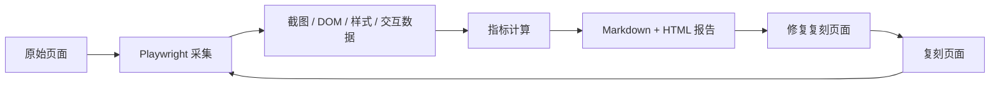

# 基于 AI 工具的网页复刻与一致性评估实施方案

> 目标：围绕“先评估框架、后网页复刻”的策略，搭建一个可长期维护、可自动评估、可部署展示、能体现 AI 使用过程的网页复刻项目。  
> 核心交付物：公开代码仓库、至少 3 个复刻页面、自动化一致性评估报告、线上访问地址、README、验收表、AI 使用记录。

## 总体策略

本项目不把“写出一个像的页面”作为第一目标，而是先建立可重复运行的一致性评估系统。这样每复刻一个页面，都能通过自动截图、DOM 检查、交互脚本、功能用例和报告生成形成闭环：采集原站基准 → AI 生成复刻代码 → 本地运行 → 自动评估 → 根据报告修复 → 提交记录。

复刻启动前必须先获取所有真实页面状态。这里的“页面”不仅指入口 URL，也包括复刻范围内会出现的关键状态页，例如首页、搜索结果页、分页后的结果页、登录表单初始态、表单校验错误态等。每个真实状态都必须先采集截图、DOM/可访问性结构、关键样式和交互说明；这些采集结果同时作为复刻程序启动标准和后续自动评估基准。若任一必需真实状态无法获取或无法确认正确，必须停止对应复刻，不允许用截图记忆、AI 猜测或 mock 页面替代真实基准。

推荐技术栈：

| 模块 | 选型 | 原因 |
| --- | --- | --- |
| 前端工程 | Vite + React + TypeScript | 启动快、结构清晰、组件化复刻方便 |
| 样式方案 | CSS Modules 或普通 CSS + CSS Variables | 降低依赖复杂度，便于逐像素调试 |
| 路由 | React Router | 为多个复刻页面提供统一入口 |
| 自动化浏览器 | Playwright | 支持截图、DOM 查询、交互流程、移动端视口、多浏览器 |
| 视觉对比 | pixelmatch + sharp + ssim.js | 支持像素差异、SSIM、差异图输出 |
| DOM/样式分析 | Playwright evaluate + computedStyle 抽样 | 量化布局、字体、颜色、间距 |
| 测试框架 | Vitest + Playwright Test | 单元测试和端到端测试分层 |
| 报告生成 | Markdown + HTML 静态报告 | 易提交、易阅读、可在 GitHub Pages 展示 |
| 部署 | Vercel 或 GitHub Pages | 前端静态部署简单，适合验收访问 |
| AI 留痕 | docs/ai-logs + commit message | 保留关键 Prompt、模型输出摘要、人工修改说明 |

建议仓库结构：

```text
web-replica-evaluator/
├── README.md
├── package.json
├── vite.config.ts
├── playwright.config.ts
├── src/
│   ├── main.tsx
│   ├── App.tsx
│   ├── routes.tsx
│   ├── pages/
│   │   ├── BaiduReplica/
│   │   ├── WeChatPayLoginReplica/
│   │   └── ThirdReplica/
│   ├── shared/
│   │   ├── components/
│   │   └── styles/
│   └── data/
├── evaluator/
│   ├── targets/
│   │   ├── baidu.json
│   │   ├── wechat-pay-login.json
│   │   └── third-page.json
│   ├── collectors/
│   │   ├── capture-original.ts
│   │   ├── capture-replica.ts
│   │   └── extract-page-profile.ts
│   ├── metrics/
│   │   ├── visual.ts
│   │   ├── dom.ts
│   │   ├── interaction.ts
│   │   ├── functionality.ts
│   │   ├── performance.ts
│   │   └── accessibility.ts
│   ├── reports/
│   │   ├── generate-markdown.ts
│   │   └── generate-html.ts
│   └── fixtures/
├── tests/
│   ├── e2e/
│   └── unit/
├── reports/
│   ├── latest/
│   └── history/
├── docs/
│   ├── ai-logs/
│   ├── prompts/
│   ├── acceptance-table.md
│   └── implementation-notes.md
└── public/
```

---

## 阶段一：项目基础搭建

### 阶段目标

完成一个可以本地运行、可以持续扩展页面、可以接入自动化评估的基础仓库。阶段一不追求页面复刻效果，只确保工程、脚本、目录和协作规范稳定。

| 步骤 | 内容 | 说明 | 交付物 |
| --- | --- | --- | --- |
| 1 | 初始化代码仓库 | 创建 GitHub 仓库、README、.gitignore，确定项目结构 | 公开仓库地址、初始 README、目录结构 |
| 2 | 确定技术栈 | 前端框架、评估工具链、部署方案 | 技术选型说明、依赖清单 |
| 3 | 搭建复刻工程脚手架 | 可运行空项目，支持本地 dev server | `npm run dev` 可启动，`/` 有页面导航 |

### 步骤 1：初始化代码仓库

实施动作：

1. 在 GitHub 创建公开仓库，例如 `web-replica-evaluator`。
2. 初始化本地仓库并提交基础文件：

```bash
git init
npm create vite@latest web-replica-evaluator -- --template react-ts
cd web-replica-evaluator
git add .
git commit -m "chore: initialize vite react project"
```

3. 新增 `.gitignore`，覆盖 Node、测试报告临时文件、截图缓存：

```gitignore
node_modules/
dist/
.env
.env.local
playwright-report/
test-results/
reports/tmp/
*.log
.DS_Store
```

4. README 第一版写清楚项目目的：

```text
本项目使用 AI 工具完成网页复刻，并通过自动化一致性评估框架量化比较原始页面与复刻页面在功能、交互、视觉、性能、可访问性上的一致程度。
```

提交建议：

```bash
git add README.md .gitignore package.json src
git commit -m "docs: add project purpose and repository structure"
```

### 步骤 2：确定技术栈

前端技术：

- `Vite + React + TypeScript`：页面复刻以组件为单位组织。
- `React Router`：统一管理 `/replica/baidu`、`/replica/wechat-pay-login`、`/replica/third`。
- `CSS Modules`：避免多个复刻页面样式互相污染。
- `lucide-react`：如需要图标，优先使用成熟图标库。

评估技术：

- `Playwright`：负责访问原始页面和本地复刻页面、截图、点击、输入、读取 DOM 与样式。
- `pixelmatch`：输出像素级差异比例和 diff 图片。
- `ssim.js`：输出结构相似度分数。
- `sharp`：统一截图尺寸、裁剪区域、图片格式。
- `axe-core`：可访问性一致性加分项。
- `lighthouse` 或 Playwright Performance API：性能一致性加分项。

脚本命令设计：

```json
{
  "scripts": {
    "dev": "vite",
    "build": "tsc && vite build",
    "preview": "vite preview",
    "test": "vitest run",
    "test:e2e": "playwright test",
    "eval:capture": "tsx evaluator/collectors/capture-all.ts",
    "eval:run": "tsx evaluator/run-evaluation.ts",
    "eval:report": "tsx evaluator/reports/generate-html.ts",
    "eval": "npm run eval:capture && npm run eval:run && npm run eval:report"
  }
}
```

部署方案：

- 首选 Vercel：每次 push 后自动构建，便于给每个页面提供线上地址。
- 备选 GitHub Pages：适合纯静态展示，可把 `reports/latest` 也发布出去。

### 步骤 3：搭建复刻工程脚手架

基础路由：

| 路径 | 用途 |
| --- | --- |
| `/` | 项目首页，展示 3 个复刻页面入口和评估报告入口 |
| `/replica/baidu` | 百度首页复刻 |
| `/replica/wechat-pay-login` | 微信支付商户登录页复刻 |
| `/replica/third` | 用户后续提供的第三个页面复刻 |
| `/reports/latest/index.html` | 最新评估报告 |

阶段一验收标准：

- `npm install` 成功。
- `npm run dev` 后可访问本地页面。
- `npm run build` 成功。
- README 写明安装、启动、构建、评估的命令。
- 第一次提交记录清晰体现项目搭建过程。

---

## 阶段二：一致性评估框架设计

> 关键原则：先完成评估框架，再做复刻。  
> 原因：复刻页面时可以随时自动打分，避免只凭肉眼主观判断；每次迭代都有报告和 commit 记录，能证明质量提升过程。  
> 原网页采集必须可信：如果原网页访问、截图、DOM 提取或关键元素识别失败，评估流程必须立即停止并输出错误原因，不能继续用主观猜测、空白截图、错误页或 AI 推断结果进行评分。

### 阶段目标

建立可配置、可自动运行、可输出报告的一致性评估框架。每个目标页面只需要维护一个配置文件，评估脚本即可完成原站采集、本地页面采集、指标计算、报告生成。

| 步骤 | 内容 | 说明 | 交付物 |
| --- | --- | --- | --- |
| 4 | 设计评估指标体系 | 定义功能、交互、视觉一致性的量化度量 | 指标文档、评分权重 |
| 5 | 实现视觉一致性评估 | 截图对比、布局、配色、字体检测 | diff 图片、视觉分数 |
| 6 | 实现功能 & 交互一致性评估 | DOM 结构对比、事件流程验证、自动化交互脚本 | Playwright 用例、交互分数 |
| 7 | 评估报告自动生成 | 输出 HTML/Markdown 报告，包含截图、评分、问题列表 | `reports/latest/index.html`、`report.md` |

### 原网页采集可信性门禁

在任何一致性评分之前，必须先完成原网页采集校验。该校验是硬门禁，不通过则终止本次评估，不生成“看似有效”的分数。

门禁范围覆盖所有复刻状态，而不是只覆盖入口页：

| 页面状态 | 示例 | 是否必须采集 |
| --- | --- | --- |
| 入口初始态 | 百度首页、微信支付登录入口页 | 必须 |
| 交互后目标态 | 百度搜索结果页、登录表单校验错误态 | 必须 |
| 分页/切换态 | 百度第 2 页结果、热榜换一换后的状态 | 与复刻范围相关时必须 |
| 异常/校验态 | 空输入提示、空密码提示、验证码缺失提示 | 与复刻范围相关时必须 |

复刻代码启动条件：

1. `evaluator/targets/*.json` 已列出所有需要复刻的真实状态。
2. 每个状态都有成功采集记录。
3. 每个状态的截图、DOM/可访问性摘要和关键 selector 校验通过。
4. 评估报告中没有“必需真实状态缺失”的错误。
5. 若真实状态需要人工操作触发，必须保存触发步骤和 `@chrome` / Playwright 观察记录。

门禁检查项：

| 检查项 | 通过条件 | 失败处理 |
| --- | --- | --- |
| URL 可访问 | HTTP 状态正常，未跳转到错误页、拦截页、登录外页面 | 停止评估，输出实际状态码和最终 URL |
| 页面加载完成 | `domcontentloaded` 和关键网络请求稳定，未超时 | 停止评估，输出超时阶段 |
| 关键元素存在 | 配置中的 `criticalSelectors` 至少全部命中或达到页面配置的最低要求 | 停止评估，列出缺失 selector |
| 截图有效 | 截图非空白、非浏览器错误页、尺寸符合视口 | 停止评估，保存失败截图用于排查 |
| DOM 提取有效 | 能读取关键节点文本、属性、布局盒模型 | 停止评估，输出提取失败字段 |
| 页面语义匹配 | 标题、核心文本或 URL 特征与目标页面匹配 | 停止评估，提示疑似进入错误页面 |

门禁状态写入 `reports/latest/source-validation.json`：

```json
{
  "pageId": "baidu",
  "status": "failed",
  "reason": "Missing critical selector: #kw",
  "originalUrl": "https://www.baidu.com",
  "finalUrl": "https://www.baidu.com/error",
  "capturedAt": "2026-05-29T10:00:00+08:00",
  "artifacts": {
    "failureScreenshot": "reports/latest/assets/baidu/source-failure.png"
  }
}
```

评估脚本执行顺序必须固定为：

```text
读取页面配置
→ 访问原网页入口状态
→ 执行入口状态采集可信性门禁
→ 执行真实交互，获取所有必需后续状态
→ 对每个真实状态执行采集可信性门禁
→ 全部必需状态门禁通过后保存原网页基准数据
→ 访问复刻页面
→ 采集复刻页面数据
→ 计算一致性指标
→ 生成报告
```

如果门禁失败，报告只展示“原网页采集失败”的诊断信息，不展示一致性总分，也不允许把失败页面作为基准参与后续对比。

若入口页通过但某个复刻范围内的后续真实状态失败，例如百度搜索结果页没有成功获取，则该页面整体不得进入复刻实现阶段，也不得只按首页截图开始编码。

交互式评估补充：

| 命令 | 用途 | 失败处理 |
| --- | --- | --- |
| `npm run eval` | 自动化/CI 评估 | 任一真实状态采集失败即中断，退出非 0，不继续评分 |
| `npm run eval:interactive` | 本地人工辅助评估 | 遇到安全验证、AI 校验、验证码或关键状态未出现时，打开可见浏览器并暂停 |

`eval:interactive` 使用持久化浏览器目录 `.evaluator-browser-profile/`。当评估器暂停时，用户需要在弹出的浏览器窗口中完成真实站点的安全验证或登录校验，确认目标状态已经正常显示后，回到终端按 Enter。评估器随后继续采集当前页面的截图、DOM、关键 selector 和样式摘要。若人工处理后仍未通过门禁，流程继续中断，不生成一致性总分。

### 步骤 4：设计评估指标体系

总分 100 分，建议权重如下：

| 维度 | 权重 | 指标 | 计算方式 |
| --- | ---: | --- | --- |
| 功能一致性 | 30 | 核心功能覆盖率 | 已通过功能用例数 / 功能用例总数 |
| 交互一致性 | 20 | 操作流程匹配度 | 交互步骤、状态变化、反馈文案逐项打分 |
| 视觉一致性 | 35 | 截图相似度、布局相似度、样式相似度 | SSIM、像素差异、元素位置差、颜色差 |
| 性能一致性 | 5 | 首屏加载时间差异 | 复刻页加载耗时接近原站，且不超过阈值 |
| 可访问性一致性 | 5 | 表单 label、按钮可访问名称、键盘操作 | axe-core 结果 + 手写断言 |
| 响应式一致性 | 5 | 多视口表现 | desktop/tablet/mobile 三档截图评分 |

评分公式：

```text
总分 = 功能分 * 0.30
     + 交互分 * 0.20
     + 视觉分 * 0.35
     + 性能分 * 0.05
     + 可访问性分 * 0.05
     + 响应式分 * 0.05
```

等级划分：

| 分数 | 结论 |
| ---: | --- |
| 90-100 | 高一致，核心验收通过 |
| 80-89 | 基本一致，有少量视觉或交互差异 |
| 70-79 | 可运行但还需明显修复 |
| 70 以下 | 不建议提交验收，需要继续迭代 |

页面配置文件示例：

```json
{
  "id": "baidu",
  "name": "百度首页",
  "originalUrl": "https://www.baidu.com",
  "replicaUrl": "http://localhost:5173/replica/baidu",
  "viewports": [
    { "name": "desktop", "width": 1365, "height": 768 },
    { "name": "mobile", "width": 390, "height": 844 }
  ],
  "criticalSelectors": [
    "#kw",
    "#su",
    ".result-list",
    ".pagination"
  ],
  "interactions": [
    {
      "name": "search keyword",
      "steps": [
        { "type": "fill", "selector": "input[name='wd']", "value": "微信支付" },
        { "type": "click", "selector": "button[type='submit']" },
        { "type": "expectText", "selector": "[data-testid='result-summary']", "value": "微信支付" }
      ]
    }
  ]
}
```

### 步骤 5：实现视觉一致性评估

视觉采集流程：

1. Playwright 打开原始页面，等待网络稳定。
2. 执行原网页采集可信性门禁，确认不是空白页、错误页、拦截页或错误跳转页。
3. 按页面配置执行真实交互，依次进入所有必需状态，例如搜索结果页、分页页、表单错误态。
4. 对每个状态注入稳定化脚本：暂停动画、隐藏光标、固定时间、关闭弹窗。
5. 保存每个原站状态截图到 `reports/latest/assets/{page}/{state}/original-{viewport}.png`。
6. 打开本地复刻页面，用同样步骤采集同名状态截图。
7. 使用 `sharp` 统一尺寸。
8. 使用 `pixelmatch` 生成差异图。
9. 使用 `ssim.js` 计算结构相似度。

视觉指标细化：

| 指标 | 说明 | 建议阈值 |
| --- | --- | --- |
| SSIM | 图片结构相似度 | `>= 0.90` |
| Pixel Difference Ratio | 像素差异比例 | `<= 8%` |
| Critical Element Bounding Box Diff | 关键元素位置和尺寸差 | 平均误差 `<= 12px` |
| Color Delta | 关键元素颜色差 | RGB 平均差 `<= 12` |
| Font Match | 字号、字重、字体族匹配 | `>= 85%` |
| Spacing Match | margin、padding、gap 接近度 | `>= 85%` |

布局检测方法：

- 对 `criticalSelectors` 中的元素读取 `boundingBox()`。
- 比较原站和复刻页面的 `x/y/width/height`。
- 对超出阈值的元素记录问题，例如：

```text
[视觉问题] 搜索按钮 x 坐标偏差 24px，超过阈值 12px。
```

配色和字体检测方法：

- 使用 `window.getComputedStyle(element)` 获取：
  - `color`
  - `backgroundColor`
  - `fontSize`
  - `fontWeight`
  - `fontFamily`
  - `borderRadius`
  - `lineHeight`
- 转换成统一格式后计算差异。

### 步骤 6：实现功能 & 交互一致性评估

功能一致性评估：

| 页面 | 功能用例 |
| --- | --- |
| 百度首页 | 输入关键词、点击搜索、展示结果文案、结果列表出现、点击翻页后页码变化 |
| 微信支付登录页 | 用户名输入、密码输入、验证码输入、登录按钮可点击、空字段校验反馈 |
| 第三个页面 | 根据用户提供页面类型定义不少于 5 个核心功能用例 |

交互一致性评估：

| 指标 | 检查内容 |
| --- | --- |
| 输入反馈 | 输入框 focus、placeholder、输入后内容保持 |
| 点击反馈 | 按钮 hover、active、disabled、loading 或错误反馈 |
| 错误状态 | 空字段、格式错误、验证码缺失时提示是否合理 |
| 键盘流程 | Tab 顺序、Enter 触发搜索或登录 |
| 状态变化 | 搜索结果出现、页码变化、登录错误提示出现 |

DOM 结构对比：

- 不要求完全复制原站 DOM，因为真实站点可能有大量无关埋点和动态节点。
- 只比较关键区域的语义结构：
  - 输入框数量与类型。
  - 按钮数量与文本。
  - 表单结构。
  - 结果列表结构。
  - 分页结构。
- 计算关键节点覆盖率：

```text
DOM 关键节点覆盖率 = 复刻页匹配的关键节点数 / 原站关键节点数
```

自动化交互脚本原则：

- 每个页面一份独立 spec：`tests/e2e/baidu.spec.ts`、`tests/e2e/wechat-pay-login.spec.ts`。
- 原站和复刻站使用同一组抽象交互步骤，减少评估偏差。
- 原站如存在风控、验证码或登录限制，不绕过真实安全机制，只评估指定范围内的输入与按钮反馈。

微信支付登录页特殊处理：

- 仅复刻用户名、密码、验证码输入区域和登录按钮点击交互。
- 不提交真实账号密码。
- 登录点击后展示本地模拟校验提示，例如“请输入完整登录信息”或“验证码错误”，用于验证交互闭环。
- 原站验证码如果无法自动读取，只比较验证码区域布局、输入框行为、错误反馈触发逻辑。

### 步骤 7：评估报告自动生成

报告内容：

| 区块 | 内容 |
| --- | --- |
| 总览 | 页面名称、原始 URL、复刻 URL、运行时间、总分、等级 |
| 评分表 | 功能、交互、视觉、性能、a11y、响应式分数 |
| 截图对比 | 原站截图、复刻截图、diff 图 |
| 关键问题 | 按严重程度列出问题、定位元素、建议修复方向 |
| 交互结果 | 每个自动化步骤是否通过、失败截图 |
| 历史趋势 | 同一页面多轮评估分数变化 |

报告文件：

```text
reports/latest/
├── index.html
├── report.md
├── summary.json
└── assets/
    ├── baidu/
    ├── wechat-pay-login/
    └── third-page/
```

报告 JSON 示例：

```json
{
  "pageId": "baidu",
  "totalScore": 91.4,
  "level": "高一致，核心验收通过",
  "scores": {
    "functionality": 96,
    "interaction": 92,
    "visual": 88,
    "performance": 95,
    "accessibility": 90,
    "responsive": 87
  },
  "issues": [
    {
      "severity": "medium",
      "category": "visual",
      "selector": "button[type='submit']",
      "message": "按钮宽度比原站小 18px"
    }
  ]
}
```

阶段二验收标准：

- `npm run eval` 可以一键运行。
- 即使复刻页面还是空页面，也能在原网页采集成功后输出评分和问题列表。
- 如果原网页采集失败，评估必须停止，并输出失败原因、最终 URL、缺失元素和失败截图。
- 报告中包含截图、diff 图、指标分数和修复建议。
- 指标权重和阈值写入文档，便于验收方理解。

---

## 阶段三：网页复刻

### 阶段目标

至少完成 3 个不同类型页面。先完成百度首页和微信支付商户登录页，再复刻用户给出的第三个页面。每个页面都按同一套流程执行，证明方法稳定。

### 复刻启动门禁

网页复刻的启动条件不是“已经看到入口页”，而是“复刻范围内所有真实页面状态均已成功采集并通过可信性校验”。因此每个页面开始编码前，必须先完成状态清单、真实采集和基准归档。

执行要求：

| 门禁项 | 要求 | 不通过处理 |
| --- | --- | --- |
| 状态清单完整 | 先列出入口页、结果页、分页态、表单错误态、弹窗态等所有复刻范围内会出现的真实状态 | 停止复刻，补全状态清单 |
| 真实页面可达 | 使用 Playwright 或 `@chrome` 打开真实 URL，并记录最终 URL、标题、关键文本 | 停止复刻，汇报访问失败、跳转异常或拦截情况 |
| 每个状态已触发 | 通过真实交互进入目标状态，例如搜索后结果页、下一页、表单校验错误态 | 停止复刻，不能用主观猜测补状态 |
| 基准资料已落盘 | 为每个状态保存截图、DOM/可访问性摘要、关键样式、交互步骤 | 停止复刻，补采缺失基准 |
| 状态正确性已确认 | 关键 selector、页面标题、核心文案与目标状态匹配 | 停止复刻，输出失败截图和原因 |

只有上述门禁全部通过，才允许进入 AI 代码生成和组件实现。该规则同时适用于百度首页、微信支付登录页和第三个用户指定页面。

| 步骤 | 页面类型 | 推荐目标 | 复刻要点 |
| --- | --- | --- | --- |
| 8 | 内容展示型 | 百度首页 `https://www.baidu.com` | 搜索框、按钮交互、结果展示、翻页 |
| 9 | 表单交互型 | 微信支付商户登录页 `https://pay.weixin.qq.com/index.php/core/home/login` | 用户名、密码、验证码输入、登录按钮交互 |
| 10 | 用户指定类型 | 用户后续给出的第三个目标页面 | 按页面类型补充功能、视觉、交互用例 |

### 每个页面统一子流程

1. 分析原始页面：
   - 先列出复刻范围内所有真实页面状态。
   - 使用 Playwright 或 `@chrome` 逐一打开/触发这些真实状态。
   - 对每个真实状态截图。
   - 对每个真实状态提取关键 DOM、可访问性结构和关键样式。
   - 记录进入每个真实状态的核心交互流程。
   - 任一必需真实状态获取失败则停止，不进入代码生成。
2. 使用 AI 工具生成复刻代码：
   - 保存关键 Prompt。
   - 保存 AI 输出摘要。
   - 标注人工修改点。
3. 本地调试至可运行：
   - 页面路由可访问。
   - 核心交互可操作。
   - 无控制台错误。
4. 运行自动评估：
   - `npm run eval -- --page baidu`
   - 查看评分、截图 diff、问题列表。
5. 根据报告修复问题：
   - 优先修复功能失败。
   - 再修复交互流程。
   - 最后修复视觉差异。
6. 提交 commit：
   - 页面初版提交。
   - 每轮评估修复提交。
   - AI Prompt 与报告快照一起提交。

### 步骤 8：百度首页复刻

复刻范围：

- 搜索输入框。
- 搜索按钮点击交互。
- 搜索结果文案展示。
- 结果列表展示。
- 简单分页功能。

必须先采集的真实状态：

| 状态 ID | 真实状态 | 触发方式 | 作用 |
| --- | --- | --- | --- |
| `home` | 百度首页初始态 | 打开 `https://www.baidu.com` | 首页视觉和搜索框基准 |
| `search-results` | 搜索结果页 | 输入关键词并按 Enter 或点击搜索 | 结果页布局、标签栏、结果卡片、侧栏基准 |
| `search-results-page-2` | 第 2 页结果或分页态 | 在真实结果页点击分页 | 分页结构和状态基准 |
| `empty-query` | 空输入提示态 | 空关键词提交，如果真实页面有反馈 | 空输入行为基准；若真实站无明显提示则记录为“无反馈” |

若 `search-results` 没有成功采集，不允许仅按首页自行设计结果页。

实现方案：

| 模块 | 说明 |
| --- | --- |
| `BaiduReplicaPage.tsx` | 页面容器，包含顶部链接区、Logo、搜索区、结果区 |
| `SearchBox.tsx` | 输入框和搜索按钮 |
| `SearchResults.tsx` | 本地模拟搜索结果列表 |
| `Pagination.tsx` | 上一页、下一页、页码 |
| `baiduResults.ts` | 固定 mock 数据，保证评估稳定 |

交互流程：

1. 初始状态展示 Logo、搜索输入框、按钮。
2. 用户输入“微信支付”。
3. 点击“百度一下”或按 Enter。
4. 页面展示结果区域，第一条结果包含关键词。
5. 点击下一页，页码变为 2，结果文案更新。

AI 关键 Prompt 示例：

```text
请基于 Vite + React + TypeScript 实现一个百度首页复刻页面，只复刻搜索输入框、搜索按钮、搜索结果文案展示和分页交互。要求组件拆分清晰，样式尽量接近百度首页，搜索结果使用本地 mock 数据，不访问真实搜索接口。请输出 src/pages/BaiduReplica 下的组件结构和 CSS Modules 样式。
```

评估重点：

| 维度 | 检查点 |
| --- | --- |
| 功能 | 搜索后出现结果、分页可切换 |
| 交互 | Enter 触发搜索、按钮 hover、页码状态变化 |
| 视觉 | 搜索框尺寸、按钮颜色、Logo 和输入区位置 |
| 响应式 | 移动端搜索框不溢出 |

提交节奏：

```bash
git commit -m "feat: add baidu replica initial page"
git commit -m "test: add baidu evaluation scenarios"
git commit -m "fix: improve baidu visual alignment from evaluation report"
git commit -m "docs: record ai prompts for baidu replica"
```

### 步骤 9：微信支付商户登录页复刻

复刻范围：

- 用户名输入框。
- 密码输入框。
- 验证码输入框。
- 登录按钮。
- 点击登录后的基础校验反馈。

实现方案：

| 模块 | 说明 |
| --- | --- |
| `WeChatPayLoginReplicaPage.tsx` | 页面整体布局 |
| `LoginPanel.tsx` | 登录表单容器 |
| `CaptchaField.tsx` | 验证码输入和模拟验证码图片 |
| `loginValidation.ts` | 本地校验规则 |
| `wechatPayLogin.module.css` | 页面独立样式 |

交互流程：

1. 初始状态展示登录区域。
2. 用户点击用户名输入框，出现 focus 状态。
3. 用户输入用户名、密码、验证码。
4. 点击登录按钮。
5. 若任一字段为空，展示对应错误提示。
6. 若字段完整，展示“当前为复刻演示，不连接真实登录服务”的提示。

安全边界：

- 不调用微信支付真实登录接口。
- 不收集、不保存、不上传任何真实账号密码。
- 验证码只做本地视觉与输入行为模拟。
- 自动评估只输入测试数据，例如 `demo_user`、`demo_password`、`1234`。

AI 关键 Prompt 示例：

```text
请实现微信支付商户登录页指定区域的 React 复刻，只包含用户名、密码、验证码输入区域，以及登录按钮点击交互。不要调用真实接口，不保存用户输入。点击登录时进行本地校验并显示错误或演示提示。样式需要接近原始页面的布局、输入框、按钮、间距和字体。
```

评估重点：

| 维度 | 检查点 |
| --- | --- |
| 功能 | 三个输入框可输入，登录按钮触发本地校验 |
| 交互 | focus、错误提示、Tab 顺序、Enter 提交 |
| 视觉 | 表单宽度、输入框高度、按钮颜色、验证码区域位置 |
| a11y | 输入框具备 label 或 aria-label |

提交节奏：

```bash
git commit -m "feat: add wechat pay login replica"
git commit -m "test: add wechat pay login interaction evaluation"
git commit -m "fix: align wechat pay login form styles"
git commit -m "docs: record ai prompts for wechat pay login"
```

### 步骤 10：第三个页面复刻

第三个页面由用户后续给出。收到目标 URL 后，沿用相同流程，新增一个页面配置和一个页面目录。

第三页选择原则：

- 类型应区别于前两页，优先选择：
  - 列表/信息流页面。
  - 管理后台页面。
  - 商品详情页。
  - 表单 + 列表混合页面。
- 至少定义 5 个核心功能点。
- 至少覆盖 desktop 和 mobile 两个视口。

第三页执行模板：

| 项目 | 内容 |
| --- | --- |
| 原始 URL | 用户提供 |
| 复刻范围 | 根据用户要求拆成关键组件和交互 |
| 页面目录 | `src/pages/ThirdReplica/` |
| 配置文件 | `evaluator/targets/third-page.json` |
| E2E 文件 | `tests/e2e/third-page.spec.ts` |
| AI 记录 | `docs/ai-logs/third-page.md` |
| 报告输出 | `reports/latest/assets/third-page/` |

稳定性验证：

完成 3 个页面后，额外选择一个同类型新页面做流程验证。目标不是完整交付第四个页面，而是证明流程具备“给出初始需求后，无需额外干预 AI”的稳定性：

1. 新增目标配置。
2. 用统一 Prompt 生成代码。
3. 运行评估。
4. 记录首次得分和主要问题。
5. 在 README 中说明该验证结果。

阶段三验收标准：

- 至少 3 个页面可本地访问。
- 每个页面都有 AI Prompt 记录。
- 每个页面都有评估报告。
- 每个页面的复刻范围内所有真实状态都已先采集，并作为复刻和评估基准。
- 每个页面至少经历一次“评估 → 修复 → 再评估”的迭代。
- commit 历史能看出 AI 使用过程和质量改进过程。

---

## 阶段四：部署与文档（Day 6）

### 阶段目标

完成线上部署、README、验收表、AI 使用记录和最终报告整理，让项目可以被验收方直接访问、运行和复核。

| 步骤 | 内容 | 说明 | 交付物 |
| --- | --- | --- | --- |
| 11 | 部署上线 | 每个复刻页面提供可访问线上地址 | Vercel/GitHub Pages 链接 |
| 12 | 完善 README | 项目介绍、技术架构、安装启动文档、AI 工具使用说明 | 完整 README |
| 13 | 填写验收表 | 按题目要求表格填写所有信息 | `docs/acceptance-table.md` |
| 14 | 整理 AI 使用记录 | 保留关键 Prompt、对话片段、人工修复说明 | `docs/ai-logs/*.md` |

### 步骤 11：部署上线

Vercel 部署流程：

1. 将仓库推送到 GitHub。
2. 在 Vercel 导入仓库。
3. Build Command 使用：

```bash
npm run build
```

4. Output Directory 使用：

```text
dist
```

5. 部署完成后记录页面链接：

| 页面 | 线上地址格式 |
| --- | --- |
| 项目首页 | `https://{project}.vercel.app/` |
| 百度复刻 | `https://{project}.vercel.app/replica/baidu` |
| 微信支付登录复刻 | `https://{project}.vercel.app/replica/wechat-pay-login` |
| 第三个页面复刻 | `https://{project}.vercel.app/replica/third` |
| 最新报告 | `https://{project}.vercel.app/reports/latest/` |

如果报告目录不进入 Vite 构建产物，则将 `reports/latest` 复制到 `public/reports/latest`，确保部署后可访问。

### 步骤 12：完善 README

README 必须包含：

1. 项目简介。
2. 技术架构图。
3. 目录结构说明。
4. 安装和启动命令。
5. 复刻页面列表。
6. 一致性评估指标说明。
7. 自动评估命令。
8. 部署地址。
9. AI 工具使用方式。
10. 关键 Prompt 链接。
11. 验收表链接。

README 命令示例：

```bash
npm install
npm run dev
npm run build
npm run eval
npm run test:e2e
```

README 架构说明示例：



### 步骤 13：填写验收表

验收表文件：`docs/acceptance-table.md`

表格格式：

| 序号 | 原始网址 | 复刻需求描述 | 复刻产物前端代码 | 复刻产物的访问地址 | 一致性评估结论 |
| --- | --- | --- | --- | --- | --- |
| 1 | `https://www.baidu.com` | 搜索框、按钮交互、结果展示、翻页 | `src/pages/BaiduReplica/` | 部署后填写 | 填写总分、等级、报告链接 |
| 2 | `https://pay.weixin.qq.com/index.php/core/home/login` | 用户名、密码、验证码输入、登录按钮交互 | `src/pages/WeChatPayLoginReplica/` | 部署后填写 | 填写总分、等级、报告链接 |
| 3 | 用户提供第三页 URL | 按用户指定范围填写 | `src/pages/ThirdReplica/` | 部署后填写 | 填写总分、等级、报告链接 |

一致性评估结论建议格式：

```text
总分 91.4 / 100，高一致。功能用例 8/8 通过，交互用例 7/8 通过，视觉 SSIM 0.92，主要差异为搜索按钮宽度偏小 18px。报告：reports/latest/index.html#baidu
```

### 步骤 14：整理 AI 使用记录

AI 记录目录：

```text
docs/ai-logs/
├── 001-project-setup.md
├── 002-evaluation-framework.md
├── 003-baidu-replica.md
├── 004-wechat-pay-login-replica.md
├── 005-third-page-replica.md
└── 006-evaluation-iteration-summary.md
```

每份 AI 记录包含：

| 字段 | 内容 |
| --- | --- |
| 时间 | AI 交互发生时间 |
| 工具 | 使用的 AI 工具，例如 CodeBuddy、Cursor、Codex、Claude Code |
| 任务 | 本次让 AI 完成的目标 |
| Prompt | 关键 Prompt 原文 |
| AI 输出摘要 | 主要生成内容 |
| 人工修改 | 人工调整了哪些代码和原因 |
| 关联 commit | 对应 commit hash |
| 评估结果 | 本轮评估分数变化 |

AI 记录示例：

```markdown
# 003 Baidu Replica AI Log

- 时间：2026-05-29
- 工具：Codex
- 任务：生成百度首页复刻页面初版
- 关联 commit：`abc1234`

## Prompt

请基于 Vite + React + TypeScript 实现一个百度首页复刻页面，只复刻搜索输入框、搜索按钮、搜索结果文案展示和分页交互……

## AI 输出摘要

生成 `BaiduReplicaPage.tsx`、`SearchBox.tsx`、`SearchResults.tsx`、`Pagination.tsx` 和样式文件。

## 人工修改

根据评估报告将搜索按钮宽度从 96px 调整为 108px，并修复移动端输入框溢出问题。

## 评估结果

- 初评：84.6
- 修复后：91.4
```

阶段四验收标准：

- 线上地址可访问。
- README 能让验收方从零启动项目。
- 验收表完整填写。
- AI 记录与 commit 对应。
- 最新评估报告可打开，包含 3 个页面结果。

---

## 6 天执行节奏建议

| 日期 | 重点任务 | 产出 |
| --- | --- | --- |
| Day 1 | 阶段一：仓库初始化、技术栈、脚手架 | 可运行空项目、README 初版 |
| Day 2 | 阶段二：指标体系、截图采集、视觉对比 | 初版评估框架和报告 |
| Day 3 | 阶段二：功能/交互评估、报告完善 | `npm run eval` 一键可用 |
| Day 4 | 阶段三：百度首页复刻与迭代 | 百度页面、AI 记录、评估报告 |
| Day 5 | 阶段三：微信支付登录页和第三页复刻 | 3 个页面初步完成 |
| Day 6 | 阶段四：部署、README、验收表、AI 记录整理 | 线上地址、最终报告、验收材料 |

---

## 风险与应对

| 风险 | 影响 | 应对 |
| --- | --- | --- |
| 原站 DOM 动态变化 | DOM 对比不稳定 | 只比较关键语义节点，不做全量 DOM 强匹配 |
| 原网页采集失败但继续评分 | 得到错误结论，影响评估可信度 | 设置原网页采集可信性门禁，失败立即停止，不生成一致性总分 |
| 只采集入口页就开始复刻 | 结果页、错误态、分页态容易凭空设计 | 启动复刻前必须列出并采集所有真实状态，缺一即停止 |
| 原站有验证码、风控、弹窗 | 自动化采集失败 | 仅评估题目指定区域，保存稳定截图基准 |
| 网络波动影响截图 | 视觉评分抖动 | 设置等待策略、重试机制、固定视口和截图区域 |
| 字体跨系统不一致 | 视觉评分偏低 | 使用字体族兜底，视觉评分加入容忍阈值 |
| AI 生成代码质量不稳定 | 页面结构难维护 | 固定组件结构和 Prompt 模板，人工 review 后提交 |
| 部署后路由 404 | 页面不可访问 | Vite 配置 base 和 SPA fallback，部署前跑 preview |

---

## 最终交付清单

- [ ] GitHub 公开仓库。
- [ ] README 完整说明。
- [ ] Vite + React + TypeScript 复刻工程。
- [ ] Playwright 自动评估框架。
- [ ] 百度首页复刻页面。
- [ ] 微信支付商户登录页复刻页面。
- [ ] 用户指定第三页复刻页面。
- [ ] 每个页面的自动评估报告。
- [ ] 线上访问地址。
- [ ] 验收表。
- [ ] AI Prompt 和对话记录。
- [ ] commit 历史体现 AI 使用和评估迭代过程。

## 推荐最终提交顺序

```text
chore: initialize project scaffold
docs: add implementation plan and evaluation strategy
feat: add evaluation metric configuration
feat: add screenshot capture and visual diff pipeline
feat: add interaction and functionality evaluation
feat: generate markdown and html evaluation reports
feat: add baidu replica page
test: add baidu evaluation scenarios
fix: improve baidu replica from evaluation report
feat: add wechat pay login replica page
test: add wechat pay login evaluation scenarios
fix: improve wechat pay login replica from evaluation report
feat: add third replica page
test: add third page evaluation scenarios
docs: add ai logs and acceptance table
docs: finalize readme and deployment links
```
