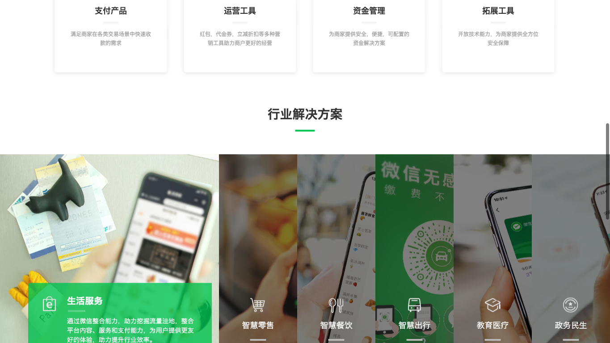
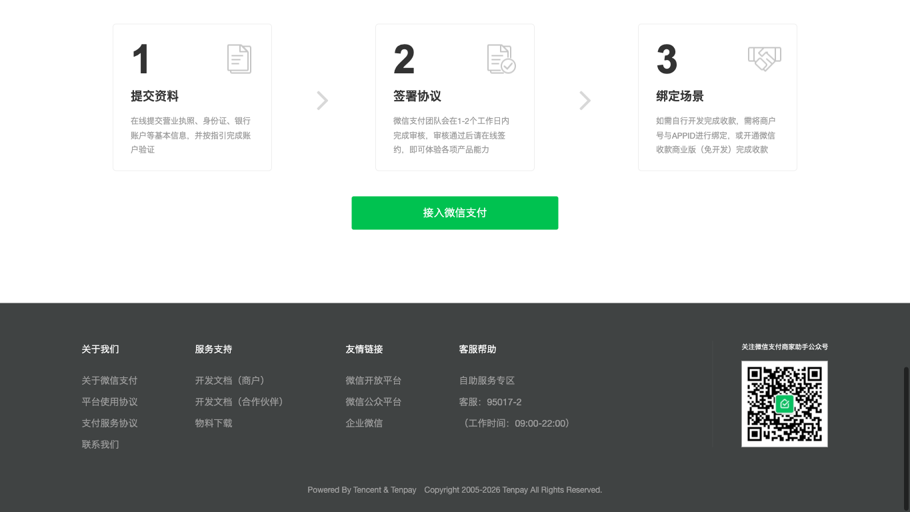

# WeChat Pay Login Form Replica Spec

## Scope

- Original URL: https://pay.weixin.qq.com/index.php/core/home/login
- Replica route: `/replica/wechat-pay-login`
- Planned access URL: http://127.0.0.1:5173/replica/wechat-pay-login
- Project source folder: `projects/wechat-pay-login/page/`
- Implementation stack: React + TypeScript + CSS Modules
- In scope: the account login panel containing username, password, captcha input area, captcha refresh affordance, login button, and local login-click feedback.
- Out of scope: real authentication, real captcha validation, merchant backend navigation, QR-code login flow after the source recovery step, and full homepage content beyond enough surrounding context to place the form.

## Source Evidence

| State | Evidence | Notes |
| --- | --- | --- |
| initial | `baselines/initial/original-top.png` | Head/top evidence after QR-mode recovery; contains the requested form panel. |
| initial | `baselines/initial/original-middle.png` | Middle evidence checked for page continuity. |
| initial | `baselines/initial/original-bottom.png` | Footer/bottom evidence checked for page continuity. |
| initial | `baselines/initial/original-dom.json` | Visible UI and style summary only; no cookies, storage, hidden inputs, or token fields. |
| initial | `baselines/initial/capture-notes.md` | Records headed Playwright session, QR recovery, and input detection. |

## Source Screenshots

## Region And Component Decomposition

| Area/region | Source state and screenshot evidence | Key elements | Visual requirements | Interaction requirements | Evaluation role | Suggested `structureSelectors` selector/count/weight | Implementation component/file |
| --- | --- | --- | --- | --- | --- | --- | --- |
| Hero shell around form | `initial` / `original-top.png` | pale hero background, nav strip, large left headline, phone image impression, login panel position | provide enough source-like context so the panel sits on a white/green WeChat Pay landing hero; no need to reproduce full homepage sections | none | visual | `[data-replica='hero-shell']` / 1 / 0.8 | `LoginHero.tsx` |
| Account login panel | `initial` / `original-top.png` | white panel, title `账号密码登录`, folded QR corner | panel at right side of hero, about 320px wide, white background, subtle shadow, square-ish corners | panel holds all functional controls | structural | `[data-replica='login-panel']` / 1 / 1 | `LoginPanel.tsx` |
| Username input row | `initial` / `original-top.png`, `original-dom.json` | icon, placeholder `登录账号` | 40px tall, pale border, grey icon, 14px placeholder | focus styling, typed value retained, empty validation | functional | `[data-replica='username-input']` / 1 / 1.5 | `LoginPanel.tsx` |
| Password input row | `initial` / `original-top.png`, `original-dom.json` | lock icon, placeholder `登录密码` | same dimensions as username row | masked input, focus styling, empty validation | functional | `[data-replica='password-input']` / 1 / 1.5 | `LoginPanel.tsx` |
| Captcha row | `initial` / `original-top.png`, `original-dom.json` | placeholder `验证码`, distorted captcha graphic, text link `换一张` | captcha input about half width; captcha graphic tan/brown; refresh link to the right | local captcha text regenerates on click; captcha field accepts typing; submit checks non-empty | functional | `[data-replica='captcha-input']` / 1 / 1.5 | `CaptchaBox.tsx`, `LoginPanel.tsx` |
| Login button | `initial` / `original-top.png`, `original-dom.json` | green button text `登录` | full panel width, 40px tall, WeChat green `#00c250`, white bold text | empty submit shows `请输入...`; filled submit shows loading then local captcha failure | functional | `[data-replica='login-button']` / 1 / 1.5 | `LoginPanel.tsx` |
| Error feedback | source form has no visible initial error; derived from form interaction state | local validation line under controls | compact red text, no layout overlap | displayed after invalid click or simulated login failure | functional | `[data-replica='form-error']` / 0-1 / 1 | `LoginPanel.tsx` |

## Interaction States

- Initial: form fields empty, no error visible.
- Focused: the focused input border becomes green-tinted.
- Empty submit: clicking `登录` with missing fields shows a local validation message beginning with `请输入`.
- Filled submit: filling all fields and clicking `登录` briefly shows loading, then a local failure message mentioning `验证码`.
- Captcha refresh: clicking `换一张` changes the local captcha display without network calls.

## Implementation Plan

- Register the route in `src/App.tsx`.
- Create project-local page files under `projects/wechat-pay-login/page/`.
- Split UI into `WechatPayLoginReplicaPage`, `LoginHero`, `LoginPanel`, and `CaptchaBox`.
- Use a local hook for form state and submit behavior.
- Use CSS Modules for the source-like layout and responsive fallback.
- Keep all behavior local; never call the original login endpoint.

## Evaluation Plan

- Evaluation command: `EVAL_TARGET_CONFIG=projects/wechat-pay-login/config/target.json npm run eval`
- Phase 6 uses `projects/wechat-pay-login/baselines/initial/` as original evidence and does not re-open the source page.
- Acceptance thresholds remain: total >= 85, functionality >= 85, interaction >= 85, visual >= 60, structure >= 80, content >= 80, engineering >= 80.

